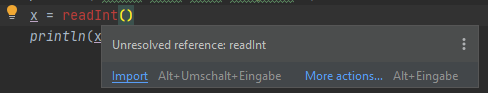
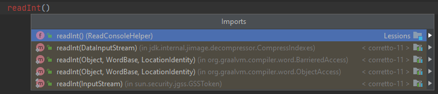

Klicke rechts oben auf  um nur die erzeugte Version dieser Anleitung zu sehen.

# Variablen

Um Wert zu speichern, verwenden wir Variablen (Schlüsselwort `var`).

Variablen können von verschieden Typen sein (welcher mit Doppelpunkt nach dem Namen angegeben wird, e.g. `x: Typ`):

## String (Zeichenkette: Zum Beispiel Wörter, Sätze, ...)
```kotlin
var x: String = "Hallo"
```

## Int (ganze Zahl)
```kotlin
var x: Int = 7
```

## Double (Kommazahl)
```kotlin
var x: Double = 3.14
```

## Boolean (Wahr/Falsch)
```kotlin
var x: Boolean = true // oder false
```

Kotlin ist sehr intelligent und erkennt den Typ automatisch, 
wenn du in der Zeile in der du die Variable definierst (dort wo `var` oder `var` steht) ihr einen Wert zuweist.
Nur wenn der Wert noch nicht bekannt ist, muss man den Typ angeben, z.B.:

```kotlin
var x: Int // Wert noch nicht bekannt, deswegen muss der Typ angegeben werden
println("Bitte eine Zahl eingeben:")
x = readInt()
println(x)
```

`readInt()` ist hierbei eine Hilfsfunktion, die dir von deiner Lehrperson bereitgestellt wird,
um Eingaben zu erleichtern, diese muss aber gegebenenfalls importiert werden
(Cursor in den roten Text setzen und `Alt+Enter`/`Option+Enter` drücken):





Wenn du bei der Ausgabe mehrere Dateitypen kombinieren willst, muss du sie auf einen gemeinsamen Typ konvertieren:
```kotlin
var wert: Int = 1
var einheit: String = "m"
println("Ergebnis: " + wert.toString() + einheit)
```
`"Ergebnis: "` und `einheit` sind hier bereits vom Typ `String`, 
also muss nur `wert` von `Int` zu `String` mittels `.toString()` umgewandelt werden.

Wenn der gemeinsame Typ `String` ist, kannst du auch Templates verwenden:
```kotlin
var wert: Int = 1
var einheit: String = "m"
println("Ergebnis: $wert $einheit")
```

#Aufgabe

Schreibe ein Programm (`Variablen.kt`) dass zwei Zahlen `a` und `b` zu `ergebnis` addiert und ausgibt `println(ergebnis)`.