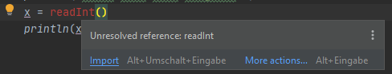
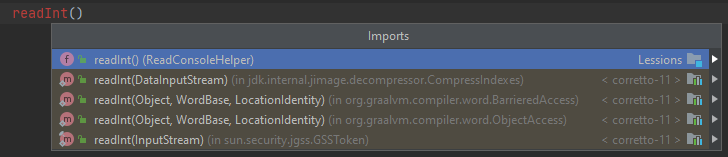

Klicke rechts oben auf  um nur die erzeugte Version dieser Anleitung zu sehen.

# Variablen

Um Wert zu speichern verwenden wir Variablen.
Davon gibt es zwei Arten:
* `val` (nur Lesbar): Wert kann nur bei der Initialisierung gesetzt werden und kann danach nicht mehr verändert werden.
* `var` (Les- und Schreibbar): Wert kann jederzeit geändert werden.
```kotlin
val x = "Hallo" // Read-only
println(x) // ergibt "Hallo"
```
```kotlin
var x = "Hallo" // Read & Write
println(x) // ergibt "Hallo"
x = "Servus"
println(x) // ergibt "Servus"
```
Wenn sich also der Wert nie ändern wird, solltest du `val` verwenden, sonst `var`.

Variablen können von verschieden Typen sein (welcher mit Doppelpunkt nach dem Namen angegeben wird, e.g. `x: Typ`):

## String (Zeichenkette = Wörter, Sätze, ...)
```kotlin
val x: String = "Hallo"
```

## Int (ganze Zahl)
```kotlin
val x: Int = 7
```

## Double (Kommazahl)
```kotlin
val x: Double = 3.14
```

## Boolean (Wahr/Falsch)
```kotlin
val x: Boolean = true // oder false
```

Kotlin ist sehr intelligent und erkennt den Typ automatisch, 
wenn du in der Zeile wo du die Variable deklarierst (dort wo `val` oder `var` steht) ihr einen Wert zuweist.
Nur wenn der Wert noch nicht bekannt ist, muss man den Typ angeben, e.g.:

```kotlin
var x: Int // Wert noch nicht bekannt, deswegen muss Typ angegeben werden
println("Bitte eine Zahl eingeben:")
x = Util.readInt()
println(x)
```

`Util.readInt()` ist hierbei eine Hilfsfunktion die dir von deiner Lehrperson bereitgestellt wird,
um das Einlesen von der Konsole zu erleichtern, diese muss aber gegebenenfalls importiert werden
(Cursor in den roten Text setzen und `Alt+Enter` drücken):





Wenn du bei der Ausgabe mehrere Dateitypen kombinieren will, muss du sie auf einen gemeinsamen Typ konvertieren:
```kotlin
val wert: Int = 1
val einheit: String = "m"
println("Ergebnis: " + wert.toString() + einheit)
```

Wenn der gemeinsame Typ String ist, kann du auch Templates verwenden:
```kotlin
val wert: Int = 1
val einheit: String = "m"
println("Ergebnis: $wert $einheit")
```

#Aufgabe

Schreibe ein Programm (`Variablen.kt`) dass zwei Zahlen `a` und `b` zu `ergebnis` addiert und ausgibt `println(ergebnis)`.