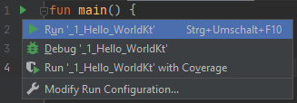
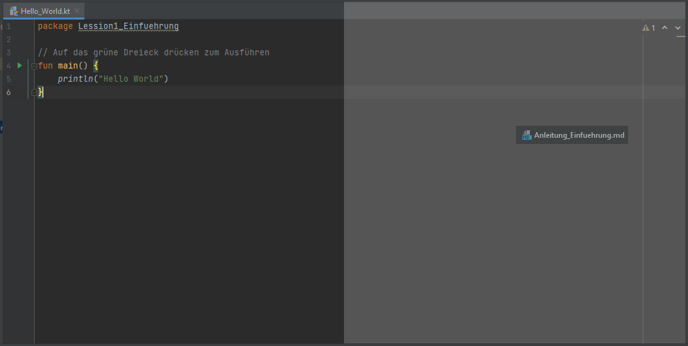
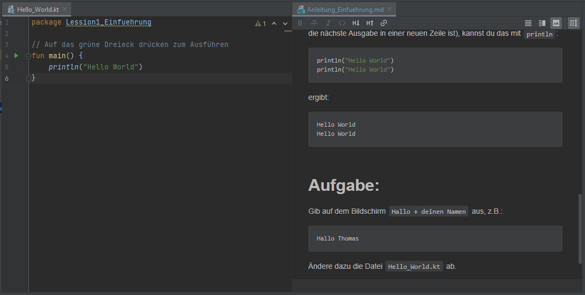

# Willkommen in unserem Kotlin-Programmierkurs

In unserem Kurs lernen wir heute Kotlin zu programmieren.
Kotlin ist eine der modernsten Programmiersprachen und sehr einfach zu lernen.

Zuerst einmal, jedes Programm braucht einen Einstiegspunkt.
Bei der Programmiersprache Kotlin ist das die `main` Funktion.
Was Funktionen sind lernen wir später, nimm das bitte fürs erste mal als einen Programmteil hin.
Die `main` Funktion wird folgendermaßen geschrieben:

```kotlin
fun main() {
    
}
```

`fun` weil Kotlin Spaß macht ;)
Stimmt nur zum Teil, Kotlin macht natürlich Spaß, `fun` steht in dem Fall aber für Funktion.
Nach dem Namen `main` folgen dann zwei runde Klammern `()` und geschwungene Klammern `{}` wo uns Programmiercode reinkommt.
Genug des theoretischen jetzt wollen wir mal was ausgeben.
Die Funktion `print()` schreibt etwas auf den Bildschirm.
Wenn man Text ausgeben will, muss man den Text unter Anführungszeichen setzen, also `print("Dies ist ein Text")`.

```kotlin
fun main() {
    print("Hello World")
}
```

Ein Programm kannst du mit dem Pfeil links der `main` Funktion  ausführen (oder `Strg+Umschalt+F10`/`Control+Umschalt+R`):



Bei dem Programm `Hello_World.kt` solltest du als Ausgabe bekommen:

```
Hello World
```

Wenn du einen Zeilenumbruch am Ende der Ausgabe machen willst (damit die nächste Ausgabe in einer neuen Zeile ist), kannst du das mit `println`:

```kotlin
println("Hello World")
println("Hello World")
```

ergibt:

```
Hello World
Hello World
```

# Aufgabe:

Gib auf dem Bildschirm `Hallo + deinen Namen` aus, z.B.:

```
Hallo Thomas
```

Ändere dazu die Datei `Hello_World.kt` ab.

**Tipp:**
Leg dir am Besten diese Anleitung und den Code nebeneinander, indem du den `Anleitung_Einfuehrung.md` Tab auf die linke/rechte Hälfte von `Hello_World.kt` ziehst:




