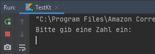

# Variablen

Um Werte zu speichern, verwenden wir Variablen (Schlüsselwort `var`).

Variablen können von verschieden Typen sein (welcher mit Doppelpunkt nach dem Namen angegeben wird, e.g. `x: Typ`):

## String (Zeichenkette: Zum Beispiel Wörter, Sätze, ...)
```kotlin
var x: String = "Hallo"
```

## Int (ganze Zahl)
```kotlin
var x: Int = 7
```

## Double (Kommazahl)
```kotlin
var x: Double = 3.14
```

Kotlin ist sehr intelligent und erkennt den Typ automatisch, 
wenn du in der Zeile in der du die Variable definierst (dort wo `var` steht) ihr einen Wert mit `=` zuweist.
Nur wenn der Wert noch nicht bekannt ist, muss man den Typ angeben, z.B.:

```kotlin
var x = 3
println(x)
```

Wenn du Text zusammen mit Variablen verwenden willst, kannst du das so machen:
```kotlin
var wert: Int = 1
var einheit: String = "m"
println("Ergebnis: $wert $einheit")
```

Mit Variablen kann man genauso wie mit Zahlen rechnen, z.B.:

```kotlin
var x = readInt("Bitte gib eine Zahl ein:")
var quadrat = x * x
println("Das Quadrat von $x ist $quadrat")
```

`readInt()` ist hierbei eine Hilfsfunktion, die dir von deiner Lehrperson bereitgestellt wird, um Eingaben zu erleichtern.
Der String `"Bitte gib eine Zahl ein:"` ist hierbei die Eingabe-Aufforderung, die ausgegeben wird:



#Aufgabe

Schreibe ein Programm (`Variablen.kt`) dass zwei Zahlen `a` und `b` zu `ergebnis` addiert und ausgibt `println(ergebnis)`.
Die Eingabe von `a` und `b` sind bereits vorgegeben.

**Tipp:** So manches kannst du dir vom letzten Beispiel abschauen.