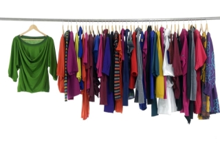

# Funktionen
Funktionen sind ein Programm zu strukturieren und Code wiederverwendbar zu machen.
Du kennst bereits eine Funktion, die `main` Funktion.
Die `main` Funktion ist eine ganz besondere Art von Funktion, da sie der Einstiegspunkt für die Programmausführung ist.
Du kannst aber auch selbst Funktionen definierten.
Die Syntax dafür besteht aus:
```kotlin
fun funktionsName(parameterName: ParameterTyp): RueckgabeTyp {
    ...
    return rueckgabeWert
}
```

Eine Funktion kann auch keine Parameter erhalten `()` oder 
nichts zurückgeben (dann entfällt `: RueckgabeTyp` und `return rueckgabeWert`).

Genau wie bei Variablen kommt der Datentyp mit Doppelpunkt getrennt nach dem Variablennamen bzw. 
beim Rückgabetyp nach dem Funktionsname UND den geschwungenen Klammern `(...)`.

## Hello World

Hier ein Beispiel einer einfachen Funktion ohne Rückgabe samt Aufruf:
```kotlin
fun sayHello(name: String) {
    println("Hello " + name)
}

fun main() {
    sayHello("World")
}
```
```
Hello World
```
Hier wird die Ausgabe in eine Funktion ausgelagert.
Die Funktion hat einen Parameter (Input) `name` vom Typ `String`, aber keinen Rückgabewert (Output).

## Maximum

Hier ein Beispiel mit zwei Parametern `a` und `b` vom Typ `String` und einem Rückgabewert vom Typ `Int`

```kotlin
fun max(a: Int, b: Int): Int {
    return if (a > b) a else b
}

fun main() {
    var ergebnis = max(5, 2)
    println(ergebnis)
}
```
```
5
```

Die Funktion `max` vergleicht die übergebenen Parameter `a` und `b` und gibt den größeren der Beiden zurück.
Bei Gleichstand (`a` ==`b`) ist es für den Rückgabewert (in dem Fall) gleichgültig, ob `a` oder `b` zurückgegeben wird.

## Summe

Oder ein Beispiel mit drei Parametern:
```kotlin
fun sum(a: Int, b: Int, c: Int = 0): Int {
    return a + b + c
}

fun main() {
    var ergebnis = sum(1, 2, 3)
    println(ergebnis)
}
```

Bis jetzt waren das immer nur ganz kurze Funktionen, wo sich das Auslagern des Codes eigentlich nicht auszahlen würde.
Funktionen sind aber nicht auf eine Zeile beschränkt, sondern können auch größer werden.
Zum Beispiel kennst du vielleicht die Fakultät oder die Fibonacci-Folge.
Keine Sorge, du musst die folgende zwei Funktionen nicht verstehen, 
sie sind nur dazu da, dir zu zeigen, dass Funktionen auch größer verwenden können.

## Fakultät (zur Anschauung)

Die [Fakultät](https://de.wikipedia.org/wiki/Fakult%C3%A4t_(Mathematik)) berechnet das Produkt von `x * (x-1) * ... * 1`, z.B.: `5! = 5 * 4 * 3 * 2 * 1 = 120`.
```kotlin
fun fak(x: Int): Int {
    var erg = 1
    for (i in x downTo 1) {
        erg = erg * i
    }
    return erg
}

fun main() {
    for (x in 1..10) {
        var ergebnis = fak(x)
        println("$x: $ergebnis")
    }
}
```
```
1: 1
2: 2
3: 6
4: 24
5: 120
6: 720
7: 5040
8: 40320
9: 362880
10: 3628800
```

<!--
## Fibonacci-Folge (zur Anschauung)

Bei der [Fibonacci-Folge](https://de.wikipedia.org/wiki/Fibonacci-Folge) ist jedes Folgen-Element die Summe der vorherigen Beiden

```kotlin
fun fibonacci(n: Int): Int {
    var f_n_minus_2 = 1
    var f_n_minus_1 = 1
    var f_n = 1
    for (i in 2..n) {
        f_n = f_n_minus_1 + f_n_minus_2
        f_n_minus_2 = f_n_minus_1
        f_n_minus_1 = f_n
    }
    return f_n
}

fun main() {
    for (n in 0..10) {
        var ergebnis = fibonacci(n)
        println("f_$n: $ergebnis")
    }
}
```
```
f_0: 1
f_1: 1
f_2: 2
f_3: 3
f_4: 5
f_5: 8
f_6: 13
f_7: 21
f_8: 34
f_9: 55
f_10: 89
```
-->

# Aufgaben

## Shoppen



Bei dem Kleidungsgeschäft deiner Wahl ist ein tolles Kleidungsstück um `x` Prozent vom angegebenen Preis verbilligt.
Der Rabatt wird aber erst an der Kassa abgezogen, du möchtest aber wissen, ob du genug Bargeld dabei hast, um das Kleidungsstück nach Rabatt zu kaufen.
Schreibe dir einen kleinen Taschenrechner als Funktion, der dir den Preis an der Kassa ausrechnet.

**Tipp:**
Beachte dabei, dass bei z.B.: `x = 35` Prozent Rabatt, der Preis an der Kassa `100 - x = 65` Prozent des ursprünglich Preises ist.
Am Ende musst du noch `/ 100` dividieren, damit der Preis nicht mehr wird.
Rechne mit dem Datentyp `Double` um Runden zu vermeiden.

## Fortgehen


Eine Frage die du dir vielleicht schon mal beim Fortgehen gestellt hast:

Du hast 50 € in der Geldbörse zum Fortgehen.
Die Bar verlangt 8 € Eintritt und dein Lieblingsgetränk kostet 3.50 €.
Wie viele Gläser/Flaschen von deinem Lieblingsgetränk kannst du dir kaufen?

Schreib eine allgemeine Funktion `berechneAnzahlLieblingsgetraenk`, die dir abhängig vom `budget`, `eintritt` und `getraenkPreis` die `getraenkAnzahl` ausrechnet.
Rechne wieder in `Double`.